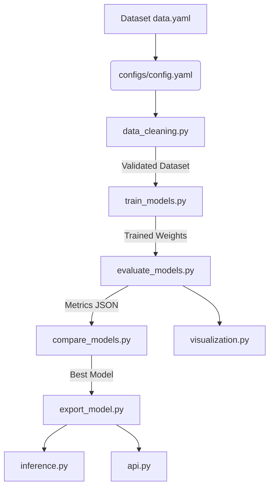

# PPE Detection Pipeline

An enterprise-grade Computer Vision pipeline for detecting Personal Protective Equipment (PPE) using YOLO-based architectures (YOLO11, RT-DETR).

## Overview

This repository provides an end-to-end production pipeline encompassing:
- Strict dataset validation and visualization
- Multi-model training (YOLO11n, YOLO11s, RT-DETR-l) with optional Optuna HPO
- Comprehensive evaluation (mAP, FPS, latency, sizing)
- Model comparison and automatic best-model selection
- Deployment export (PyTorch, ONNX, TorchScript)
- Multi-source inference engine (Image, Video, Webcam, RTSP, YouTube)
- FastAPI REST API with OpenAPI documentation
- Dockerized deployment (GPU & CPU)
- CI/CD pipeline via GitHub Actions

### Architecture



## Dataset

The pipeline is configured for a 17,264-image YOLO dataset with 6 classes:
`boots`, `gloves`, `goggles`, `helmet`, `person`, `vest`.

Labels are in YOLOv8 segmentation polygon format (automatically handled by the Ultralytics backend for detection).

## Installation

### Local Environment
```bash
python -m venv .venv
source .venv/bin/activate  # On Windows: .venv\Scripts\activate
pip install -r requirements.txt
```

### Docker (Recommended for API)
```bash
# Start API with GPU support (if available)
docker compose up -d
```

## Usage Guide

All scripts use `configs/config.yaml` by default.

### 1. Data Validation
Validates dataset integrity and generates visual reports. Aborts if critical issues are found.
```bash
python data_cleaning.py
```

### 2. Training
Trains all models specified in config.yaml sequentially.
```bash
python train_models.py

# Optional: Run with Hyperparameter Optimization
python train_models.py --hpo --n-trials 15

# Train specific models only
python train_models.py --models yolo11n
```

### 3. Evaluation
Computes all metrics and generates error analysis.
```bash
# Evaluate all trained models
python evaluate_models.py

# Evaluate specific model
python evaluate_models.py --model models/yolo11n/weights/best.pt
```

### 4. Comparison & Ranking
Ranks models based on a composite score (mAP, FPS, Size, F1).
```bash
python compare_models.py
```

### 5. Export
Exports the selected model to deployment formats.
```bash
python export_model.py --model best_model.pt
```

### 6. Visualization
Generates publication-quality PNG and SVG charts.
```bash
# Generate all charts
python visualization.py --type all

# Specific categories
python visualization.py --type dataset
python visualization.py --type training
python visualization.py --type comparison
```

### 7. Inference
Runs detection on various sources and computes PPE violations (e.g., person without helmet).
```bash
# Images / Folders
python inference.py --model best_model.pt --source archive/test/images/ --save

# Webcam
python inference.py --model best_model.pt --source 0 --show

# YouTube / Video
python inference.py --model best_model.pt --source "https://youtu.be/..." --save-video
```

### 8. REST API
Starts the FastAPI backend.
```bash
python api.py --model best_model.pt --port 8000
```
- Interactive Docs (Swagger UI): `http://localhost:8000/docs`
- Health check: `http://localhost:8000/health`

## Extending the Pipeline

The codebase uses a `DetectorRegistry` plugin architecture. To add a new framework (e.g., Detectron2, MMDetection):

1. Create a new adapter class in `utils.py` that implements `DetectorProtocol`.
2. Register it: `DetectorRegistry.register("faster_rcnn", MyDetectronAdapter)`
3. Add it to `config.yaml` models list.
No changes to the core training or evaluation loops are required.

## License

MIT

---

## Author

<div align="center">

### Built with precision by **Mohammad Abo Al Ghozlan (MoGhoz)**

**Full-Stack Developer • Software Engineer • Backend Engineer**

Passionate about building production-grade software systems, scalable backend architectures, AI-powered applications, and enterprise automation solutions.

**GitHub:** https://github.com/Mohammad-Abo-Al-Ghozlan
**LinkedIn:** https://linkedin.com/in/mohammad-abo-al-ghozlan
**Portfolio:** https://mohammad-ghozlan.vercel.app

*"Engineering software that bridges intelligent algorithms with real-world applications."*

</div>
